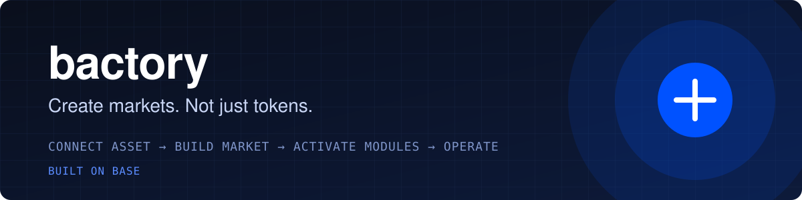

<p align="center">
  
</p>

<p align="center">
  <a href="https://bactory.tech"></a>
  <a href="https://x.com/bactorydottech"></a>
  
  
</p>

**Bactory is modular market infrastructure on Base.** It does not launch tokens. It builds a **market** around an asset that
already exists, and lets the market's builder switch on **modules** around it: a treasury, a yield vault and an agent guard
today; liquidity, bounties and community next.

**Agents propose. Contracts enforce.** AI agents can run a market's treasury, but they never hold its assets. Every action they
propose goes through an onchain `AgentGuard` that checks rate limits, oracle freshness, approved strategies, action limits and
reserves. Three rejected proposals and the agent is suspended.

## Repositories

| | |
| --- | --- |
| [**bactory**](https://github.com/bactory-tech/bactory) | The protocol: factory, markets, treasury, ERC-4626 yield vault and AgentGuard. |
| [**mcp**](https://github.com/bactory-tech/mcp) | MCP server that gives Claude, Cursor and other AI assistants live Base market data, strategy backtests, AgentGuard checks and a reference treasury agent. |
| [**sdk**](https://github.com/bactory-tech/sdk) | TypeScript SDK for building on Bactory. |

## How a market fits together

```
                 BactoryFactory
                       │  buildMarket(asset, quote, config)
                       ▼
 existing ERC-20 ── Market ──────────────── routeFees(token, amount)
                       │                      │  split by config
       ┌───────────────┼───────────────┐      ▼
  TreasuryModule    YieldVault     AgentGuard
  (capital, limits) (ERC-4626)     (agents propose, contract enforces)
```

## Status

In development. Contracts are unaudited and not deployed to Base mainnet. Nothing here is financial advice.
